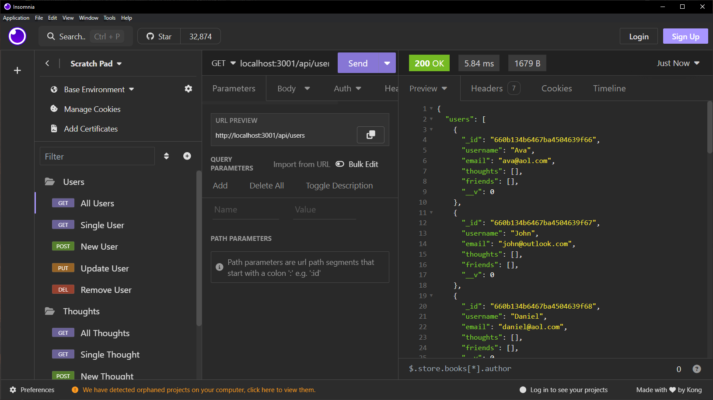

# SocialBlogBackend
  
  ## Description
  This project creates a document database that stores users, user thoughts, and reactions to thoughts. It uses NoSQL as a database and uses Mongoose for interfacing. It also incorporates Moment.js for time conversion.
  
  [Link to YouTube video](https://youtu.be/N9qv154-O1g)
  ## Table of Contents
- [SocialBlogBackend](#socialblogbackend)
  - [Description](#description)
  - [Table of Contents](#table-of-contents)
